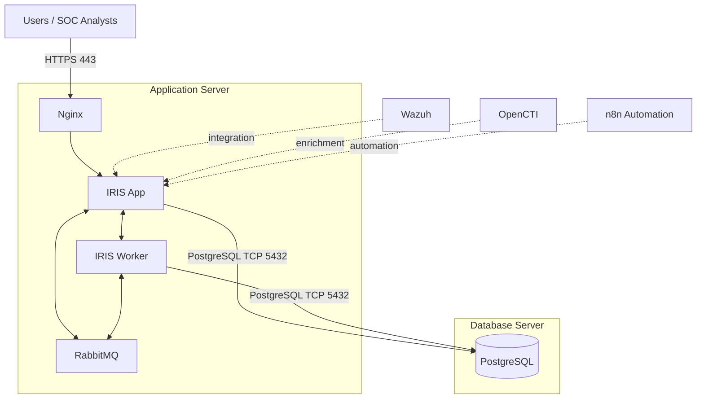

<div align="center">

# 🛡️ DFIR-IRIS Distributed SOC Platform

### Reproducible, Multi-Tenant, SOC-Hardened DFIR-IRIS Deployment


**Official DFIR-IRIS Base + Versioned SOC Security Patch + Custom Docker Image + Distributed Installer**

</div>

---

## 📖 Overview

This repository turns DFIR-IRIS into a reproducible deployment platform designed for SOC environments.

The project keeps the official DFIR-IRIS source as the upstream base, verifies the exact expected upstream commit, applies a versioned SOC hardening patch, builds a custom Docker image, and deploys the result through a role-based installer.

The design focuses on four major goals:

- **Multi-tenant customer isolation**
- **SOC role-based access control**
- **Reproducible and portable deployment**
- **Distributed application and database architecture**

The platform is designed for environments where an internal SOC or Managed Security Service Provider may operate IRIS for multiple customers while maintaining strict tenant separation.

> This repository is not a replacement fork of DFIR-IRIS.
>
> The installer deliberately starts from the official DFIR-IRIS `v2.4.29` source and applies the versioned SOC customization package maintained in this repository.

---

# 🚀 Release Information

| Component | Version |
|---|---|
| Installer | `1.1.0` |
| DFIR-IRIS upstream | `v2.4.29` |
| SOC release | `v2.4.29-soc.1` |
| Custom application image | `iris-soc:v2.4.29-soc.1` |
| Upstream base commit | `340ce04080806a83837b713d01ea70632ee2b3f7` |

The SOC release metadata is stored under:

```text
soc/
├── BASE_COMMIT
├── VERSION
└── patches/
    └── 0001-SOC-multi-tenant-authorization-hardening-for-IRIS-v2.patch
```

This allows every deployment to verify exactly which official IRIS version the SOC customization was built against.

---

# 🏗️ Architecture

## Recommended Distributed Deployment



The architecture separates application processing from database storage.

### Application Server

```text
Nginx
IRIS Application
IRIS Worker
RabbitMQ
```

### Database Server

```text
PostgreSQL
```

The Application Server is the user-facing IRIS system.

PostgreSQL should be bound only to the required interface and restricted by host and network firewall rules so that only authorized application servers can connect.

---

# 🔐 SOC Security Model

The authorization model follows the principle:

```text
Identity + Tenant Scope + Role + Object Access = Effective Access
```

Each part of the model has a specific responsibility.

---

## Identity

The authenticated IRIS account determines who is performing the operation.

Accounts may represent:

- Human SOC analysts
- SOC administrators
- Auditors
- Platform administrators
- Wazuh integration services
- OpenCTI integration services
- n8n automation services

---

## Tenant Scope

`UserClient` is treated as the hard tenant boundary.

A normal SOC user must belong to the customer that owns a case before access to that case can be granted.

This means:

```text
Case access cannot override tenant membership.
```

Even if an incorrect or stale case-level access record exists, a user should not gain access to another customer's data without valid `UserClient` membership.

---

## Role Capabilities

`UserGroup + Permissions` defines what a user is allowed to do inside their authorized tenant scope.

For example:

```text
SOC Viewer
    ↓
Can read cases

SOC L1
    ↓
Can investigate and work with IOCs

SOC L2
    ↓
Can additionally close and reopen cases

SOC L3
    ↓
Can perform additional destructive investigation actions

SOC Admin
    ↓
Can manage tenant users, ACLs and case lifecycle
```

Roles define capabilities.

They do not define tenant scope.

---

## Object-Level Access

IRIS native case access remains part of the effective access decision.

However, case-level access cannot increase privileges beyond the user's authorized tenant membership.

The effective access model therefore becomes:

```text
Tenant Membership
        +
Role Permission
        +
Case Access
        =
Effective Authorization
```

---

# 👥 SOC Roles

The SOC release defines the following role structure.

| Role | Purpose |
|---|---|
| **Platform Admin** | Global platform administration across all tenants |
| **SOC Viewer** | Read-only case visibility |
| **SOC Auditor** | Read-only access plus tenant-scoped activity visibility |
| **SOC L1** | Investigation, alerts and IOC creation/update |
| **SOC L2** | L1 capabilities plus case close/reopen |
| **SOC L3** | L2 capabilities plus destructive IOC/alert operations |
| **SOC Admin** | Tenant administration, ACL management and user management |
| **Wazuh Service** | Alert ingestion service identity |
| **OpenCTI Service** | Threat intelligence / IOC enrichment identity |
| **n8n Automation** | Workflow automation identity |

---

# 👑 Platform Administrator

The Platform Administrator remains the only globally privileged identity.

The native IRIS permission:

```text
server_administrator
```

is reserved for the Platform Administrator.

Platform administrators can operate globally across customers and platform configuration.

Tenant SOC administrators do **not** receive this permission.

---

# 🛡️ SOC Admin

The SOC Admin operates inside assigned tenants.

Typical capabilities include:

```text
SOC L3 capabilities
+
case deletion
+
case ACL management
+
tenant user management
+
tenant activity visibility
+
customer update capabilities
```

However, SOC Admin does not automatically become a global platform administrator.

The same SOC Admin role may therefore be used for:

```text
Provider SOC Admin
```

or

```text
Customer SOC Admin
```

while `UserClient` membership determines which tenant or tenants that administrator can manage.

---

# 👁️ SOC Viewer

Designed for users who need visibility without modification rights.

Typical capabilities:

```text
Read cases
Read alerts
Search authorized cases
Read customers
Read case templates
Read statistics
Read custom dashboards
```

Viewer users cannot normally:

```text
Modify cases
Create IOCs
Delete IOCs
Close cases
Reopen cases
Delete cases
Manage ACLs
Manage tenant users
```

---

# 📋 SOC Auditor

Auditor is based on Viewer but includes tenant-scoped activity access.

This allows auditors to review investigation history and SOC actions without receiving normal analyst modification privileges.

---

# 🔎 SOC L1

SOC L1 is designed for first-line investigation.

Capabilities include:

```text
Case investigation
Alert handling
IOC creation
IOC updates
Case creation
Activity visibility
Tenant-scoped search
```

L1 does not normally receive:

```text
Case delete
IOC delete
Case ACL management
Case close
Case reopen
```

---

# 🧠 SOC L2

SOC L2 includes the SOC L1 capabilities and adds:

```text
case_close
case_reopen
```

This allows L2 analysts to manage the investigation lifecycle without receiving broader administrative privileges.

---

# 🔥 SOC L3

SOC L3 extends L2 with higher-impact investigation actions.

Examples include:

```text
IOC deletion
Alert deletion
Advanced incident handling
```

Administrative functions such as tenant user management remain separate.

---

# 🤖 Service Accounts

Service identities are deliberately separated from human analyst roles.

---

## Wazuh Service

Designed for Wazuh alert ingestion.

Purpose-specific permission:

```text
alerts_ingest
```

The account does not need normal interactive SOC privileges.

---

## OpenCTI Service

Designed for intelligence enrichment.

Typical permissions:

```text
cases_read
ioc_write
```

This allows OpenCTI to enrich authorized cases without granting unrestricted case modification rights.

---

## n8n Automation

Designed for controlled automation workflows.

Typical capabilities include:

```text
cases_read
alerts_read
alerts_write
ioc_write
```

The automation account remains tenant constrained.

---

# 🔒 Security Hardening in `v2.4.29-soc.1`

The SOC patch introduces authorization controls across several important IRIS components.

---

## Tenant-Aware Case Authorization

A mandatory low-level tenant check has been added to case authorization.

For non-platform administrators:

```text
User requests case
        ↓
Check UserClient membership
        ↓
Check tenant access level
        ↓
Check case access
        ↓
Return effective access
```

If the user does not belong to the customer owning the case:

```text
ACCESS DENIED
```

---

# 🔍 Tenant-Scoped Search

Global search is constrained to cases accessible to the authenticated user.

Cross-customer case names, IOCs and investigation data should therefore not appear to unauthorized tenant users.

---

# 📊 Tenant-Scoped Activities

Global activity visibility is constrained to cases inside the authenticated user's authorized tenant scope.

Contextless activity visibility is also restricted appropriately.

This prevents normal SOC users from using global activity pages to discover another customer's investigation activity.

---

# 📑 Report Authorization

Case activity and investigation reports require authorized case access.

Knowing a case ID alone is not enough to retrieve another tenant's report.

---

# 🔄 Tenant-Aware Auto-Follow

IRIS auto-follow behavior has been modified to respect customer membership.

Groups are selected according to the relevant customer rather than being automatically applied across unrelated tenants.

---

# 🗑️ Case Deletion Control

Case deletion now uses a dedicated permission:

```text
case_delete
```

instead of relying only on broad legacy user permissions.

---

# 🔐 Case ACL Management

Case ACL administration uses:

```text
case_acl_manage
```

The Access tab is also hidden from unauthorized users.

This separates incident investigation privileges from access-control administration.

---

# ✅ Case Close / Reopen

Dedicated lifecycle permissions were added:

```text
case_close
case_reopen
```

This enables a clear difference between L1 and L2 responsibilities.

---

# 🧬 IOC Authorization

IOC modification is controlled through dedicated permissions:

```text
ioc_write
ioc_delete
```

This also allows integration identities such as OpenCTI to receive IOC-specific capabilities without being given full case-editing privileges.

---

# 🚨 Alert Authorization

Alert ingestion is separated from normal analyst alert operations.

Dedicated permission:

```text
alerts_ingest
```

allows a service account such as Wazuh to ingest alerts while remaining isolated from unnecessary human-user permissions.

---

# 👤 Tenant User Administration

SOC tenant administrators can manage approved human SOC users only inside their authorized customer scope.

Controls prevent tenant administrators from:

```text
Managing users from unrelated customers
Managing service accounts
Assigning platform-level groups
Creating platform administrators
Managing global role definitions
Renewing privileged API keys
```

Global group administration remains reserved for Platform Administrators.

---

# 🏢 Customer Lifecycle Security

Customer creation and deletion are controlled through:

```text
platform_tenants_manage
```

Tenant SOC administrators may operate inside assigned customers without receiving the ability to create or remove platform tenants.

---

# 🌐 Administrative WebSocket Hardening

Server-update WebSocket functionality requires:

```text
Authenticated user
+
server_administrator
```

This prevents normal SOC users from invoking platform-level server update operations.

---

# 🧩 Custom SOC Permissions

The current SOC release extends the IRIS permission model with:

```text
case_delete
case_acl_manage
platform_tenants_manage
tenant_users_read
tenant_users_manage
cases_read
ioc_write
ioc_delete
alerts_ingest
case_close
case_reopen
```

These permissions use the existing IRIS BigInteger permission mask.

Because of this, every future upstream upgrade must include a permission-bit collision review.

---

# 🏭 Reproducible Build Process

The installer does not depend on manual changes inside running containers.

Instead, the Application Server installation performs:

```text
Official DFIR-IRIS v2.4.29
            ↓
Verify exact upstream base commit
            ↓
git apply --check SOC patch
            ↓
Apply SOC patch
            ↓
Build custom Docker image
            ↓
iris-soc:v2.4.29-soc.1
            ↓
Deploy IRIS App + Worker
```

This creates a reproducible deployment.

A normal:

```text
Docker restart
Container restart
Server reboot
Container recreation
```

does not depend on undocumented runtime `docker cp` modifications.

---

# 🐳 Custom Docker Image

The current application image is:

```text
iris-soc:v2.4.29-soc.1
```

The build also records OCI metadata including:

```text
SOC version
Upstream base commit
Image ID
Build time
```

Build provenance is stored under:

```text
.soc-build/
```

inside the installed IRIS source directory.

---

# ⚙️ Installer

Clone the repository:

```bash
git clone https://github.com/WaleedAlBalushi/dfir-iris-distributed.git
cd dfir-iris-distributed
```

Make the installer executable:

```bash
chmod +x install.sh
```

Run:

```bash
sudo ./install.sh
```

The installer provides:

```text
1) Database Server
   PostgreSQL only

2) Application Server
   Nginx + IRIS App + Worker + RabbitMQ

3) Single-Node / Lab
   SOC-hardened all-in-one deployment

0) Exit
```

---

# 🗄️ Database Server

Choose:

```text
1) Database Server
```

Default installation:

```text
/opt/iris-db/
├── .env
├── .iris-role
├── docker-compose.yml
├── setup.sh
├── backups/
└── secrets/
    └── application-connection.env
```

The installer performs:

```text
PostgreSQL credential generation
Database configuration
Interface / port binding
Compose validation
Docker image pull
Database startup
PostgreSQL readiness check
Authentication test
Connection file generation
```

Sensitive configuration files are created with restrictive permissions.

---

# 📦 Database Connection File

The Database Server generates:

```text
/opt/iris-db/secrets/application-connection.env
```

This file contains the database information needed by the Application Server.

It should be transferred securely.

Example:

```bash
scp /opt/iris-db/secrets/application-connection.env \
    user@app-server:/tmp/application-connection.env
```

The Application Server installer can then import it.

---

# 🖥️ Application Server

Choose:

```text
2) Application Server
```

Default installation:

```text
/opt/iris-web/
├── .env
├── .iris-role
├── .soc-build/
│   ├── VERSION
│   ├── BASE_COMMIT
│   ├── BUILD_TIME
│   ├── IMAGE_ID
│   └── patches/
├── docker-compose.distributed-app.yml
├── setup.sh
├── backups/
├── integrations/
├── lib/
├── secrets/
│   └── initial-credentials.txt
└── ... DFIR-IRIS source ...
```

The Application Server installer can either:

```text
Enter database information manually
```

or:

```text
Import application-connection.env
```

Before IRIS is deployed, the installer validates:

```text
Database network connectivity
PostgreSQL application credentials
PostgreSQL administrative credentials
```

---

# 🔧 Application Build Flow

During Application Server installation:

```text
Clone official IRIS v2.4.29
        ↓
Verify expected upstream commit
        ↓
Validate SOC patch
        ↓
Apply SOC patch
        ↓
Build iris-soc:v2.4.29-soc.1
        ↓
Generate application configuration
        ↓
Start RabbitMQ
        ↓
Start IRIS Application
        ↓
Start IRIS Worker
        ↓
Start Nginx
        ↓
Run health checks
```

---

# 🧪 Single-Node / Lab

Choose:

```text
3) Single-Node / Lab
```

This mode runs the complete stack on one machine.

It is intended primarily for:

```text
Development
Testing
Demonstrations
Security regression testing
Integration testing
```

The distributed Application/Database architecture remains the recommended production-oriented design.

The single-node installer still builds the same:

```text
iris-soc:v2.4.29-soc.1
```

application image.

---

# ⚠️ Worker Isolation

IRIS uses:

```text
IRIS_WORKER=1
```

to distinguish worker behavior from the web application.

The deployment intentionally sets this variable only on the Worker service.

It must not be placed inside the shared `.env` file because doing so causes the web application to start using worker-specific configuration.

---

# 🛠️ Management Interface

Both deployment roles receive their own management console.

---

## Database Management

Examples:

```bash
/opt/iris-db/setup.sh status
```

```bash
/opt/iris-db/setup.sh doctor
```

```bash
/opt/iris-db/setup.sh backup
```

```bash
/opt/iris-db/setup.sh connections
```

The management console includes functionality for:

```text
Database Services
Backup & Restore
Health & Connectivity
Storage & Connections
Configuration & Maintenance
```

---

# 🖥️ Application Management

Examples:

```bash
/opt/iris-web/setup.sh status
```

```bash
/opt/iris-web/setup.sh doctor
```

```bash
/opt/iris-web/setup.sh db-test
```

```bash
/opt/iris-web/setup.sh backup-app
```

```bash
/opt/iris-web/setup.sh wazuh
```

```bash
/opt/iris-web/setup.sh opencti
```

The management interface includes:

```text
IRIS Services
Integrations
Health & Diagnostics
Configuration & Security
Backup & Maintenance
Upgrade Tools
```

---

# 🔗 Integration Model

The application-side integration tooling preserves the previously tested workflow rather than recreating integrations from scratch.

---

## Wazuh

Wazuh is intended to provide detection and alert telemetry to the SOC platform.

Conceptually:

```text
Endpoints
   ↓
Wazuh
   ↓
IRIS Alert / Incident Workflow
```

The SOC authorization model also provides a dedicated:

```text
Wazuh Service
```

role for controlled alert ingestion.

---

# 🌐 OpenCTI

OpenCTI provides threat intelligence and enrichment capabilities.

Conceptually:

```text
IRIS IOC
   ↓
OpenCTI
   ↓
Threat Intelligence
   ↓
IRIS Enrichment
```

The dedicated:

```text
OpenCTI Service
```

role allows IOC enrichment without granting unrestricted SOC analyst privileges.

---

# 🔄 n8n Automation

n8n is planned as the automation/orchestration layer.

Conceptually:

```text
Detection
   ↓
IRIS
   ↓
n8n
   ↓
Enrichment / Notification / Workflow
   ↓
IRIS
```

The dedicated:

```text
n8n Automation
```

role provides controlled automation access.

---

# 🧭 SOC Platform Direction

The wider SOC platform architecture is designed around:

```text
Wazuh
   ↓
Detection

IRIS
   ↓
Incident / Case Management

OpenCTI
   ↓
Threat Intelligence

n8n
   ↓
Automation / Orchestration
```

IRIS acts as the central incident and case-management layer.

---

# 🔑 Secret Handling

Important generated files include:

```text
/opt/iris-db/.env
/opt/iris-db/secrets/application-connection.env
```

and:

```text
/opt/iris-web/.env
/opt/iris-web/secrets/initial-credentials.txt
```

These files contain sensitive information and should be protected.

The installer:

```text
Uses restrictive file permissions
Hides secrets from normal status output
Generates random application secrets
Generates random API keys
Generates random database credentials when requested
```

For production environments, long-lived credentials should eventually be moved into the organization's approved secrets-management platform.

---

# ✅ Validation Completed

The SOC implementation has already been tested across multiple layers.

---

## SOC Viewer

Validated:

```text
Customer A cases visible
Customer B cases hidden
Customer A IOC visible
Customer B IOC hidden
Cross-tenant direct case access denied
Cross-tenant global search denied
Case editing denied
IOC creation denied
Case close denied
Case deletion denied
ACL tab hidden
Global Activities hidden
```

---

# ✅ SOC Auditor

Validated:

```text
Tenant case visibility
Cross-tenant isolation
Tenant IOC isolation
Case mutations denied
IOC mutation denied
Case lifecycle actions denied
ACL hidden
Global Activities visible
Activities restricted to own tenant
```

---

# ✅ SOC L1

Validated:

```text
Own tenant cases visible
Cross-tenant cases hidden
IOC creation allowed
IOC modification allowed
Case creation allowed
Case investigation allowed
Case close denied
Case reopen denied
Case deletion denied
IOC deletion denied
ACL management denied
Activities tenant scoped
Search tenant scoped
```

---

# ✅ SOC L2

Validated:

```text
SOC L1 capabilities
Case close allowed
Case reopen allowed
Case delete denied
IOC delete denied
ACL management denied
Activities tenant scoped
Search tenant scoped
```

---

# 🧪 Build Validation

The SOC release has successfully passed:

```text
Clean official IRIS clone
Exact base commit verification
SOC patch apply check
Python source compilation
Custom Docker image build
Custom permission inspection inside image
Tenant-gate inspection inside image
Fresh PostgreSQL initialization
Fresh IRIS initialization
SOC role creation
HTTPS application response test
GitHub-only fresh clone verification
```

---

# 🗃️ Fresh Database Validation

A clean IRIS database initialization successfully created:

```text
82 database tables
```

and initialized the expected SOC groups including:

```text
SOC Viewer
SOC Auditor
SOC L1
SOC L2
SOC L3
SOC Admin
Wazuh Service
OpenCTI Service
n8n Automation
```

---

# 🔍 GitHub Portability Validation

The repository has also been tested by performing a fresh clone directly from GitHub.

Verified:

```text
Correct branch
Correct SOC VERSION
Correct BASE_COMMIT
Installer Bash syntax
SOC patch package presence
```

This confirms that the deployment package can be reconstructed from the repository rather than depending on the original development machine.

---

# 🚧 Production Readiness

`v2.4.29-soc.1` is the current SOC-hardened baseline.

Several final security and operational tests should still be completed before treating the deployment as fully production-ready.

---

## Remaining Security Regression

A deliberate stale/cross-tenant effective-access test should be performed.

Example test:

```text
Customer A user
        ↓
Artificial cross-tenant UCEA access to Customer B case
        ↓
Verify direct access DENIED
        ↓
Verify search DENIED
        ↓
Verify case list DENIED
        ↓
Verify activities DENIED
```

This is important because some bulk IRIS functions historically use effective-access lists directly.

The final production version should guarantee that bulk access is also intersected with the `UserClient` tenant boundary.

---

# 🧪 Remaining Role Tests

Final critical-path testing should also cover:

```text
SOC L3
SOC Admin
Wazuh Service
OpenCTI Service
n8n Automation
```

---

# 🔄 Remaining Operational Tests

Before declaring production readiness:

```text
Container recreation test
Application restart test
Database restart test
Full server reboot
Database backup test
Database restore test
Application backup test
Rollback test
Integration regression
Security regression
```

---

# 🔒 Production Hardening Checklist

Production environments should additionally review:

- Firewall restrictions
- PostgreSQL network exposure
- Trusted TLS certificates
- Database TLS if required
- Operating-system hardening
- Docker hardening
- Centralized logging
- Centralized backup retention
- Restore testing
- Secrets vault integration
- Monitoring
- Alerting
- High availability
- Disaster recovery
- Administrative audit controls

---

# 🔄 Upgrade Strategy

Do not automatically move the SOC patch onto a newer DFIR-IRIS release.

Each upstream upgrade should follow:

```text
1. Review DFIR-IRIS release notes
        ↓
2. Identify exact upstream commit
        ↓
3. Review upstream authorization changes
        ↓
4. Review database/schema changes
        ↓
5. Check SOC permission-bit collisions
        ↓
6. Rebase or regenerate SOC patch
        ↓
7. Build new SOC Docker image
        ↓
8. Run security regression tests
        ↓
9. Test backup / restore
        ↓
10. Test rollback
        ↓
11. Promote release
```

Controlled environments should avoid:

```text
latest
```

Docker tags.

Instead use fixed release identities such as:

```text
iris-soc:v2.4.29-soc.1
```

---

# 📁 Repository Layout

```text
dfir-iris-distributed/
├── install.sh
├── VERSION
├── CHANGELOG.md
├── MANIFEST.sha256
│
├── docs/
│   ├── ARCHITECTURE.md
│   └── TEST_PLAN.md
│
├── lib/
│
├── scripts/
│
├── templates/
│   ├── app/
│   ├── db/
│   └── single/
│
└── soc/
    ├── VERSION
    ├── BASE_COMMIT
    └── patches/
        └── 0001-SOC-multi-tenant-authorization-hardening-for-IRIS-v2.patch
```

---

# 🧱 Design Principles

The project follows several important design rules.

### 1. Tenant membership is the hard security boundary

```text
No UserClient membership
=
No tenant access
```

### 2. Roles define capability, not customer scope

The same SOC role can safely be reused across tenants.

### 3. Object access cannot expand tenant access

Case ACLs cannot turn a Customer A identity into a Customer B identity.

### 4. Platform administration remains separate

Global platform administration is not assigned to tenant SOC administrators.

### 5. Service identities are purpose specific

Integration accounts receive only the permissions required for their integration workflow.

### 6. Upstream IRIS is pinned

The installer verifies the exact upstream commit before applying SOC customization.

### 7. SOC changes are versioned

Security modifications are maintained as source patches rather than undocumented runtime container modifications.

### 8. Docker images are reproducible

The customized IRIS image is generated from the verified source and SOC patch.

### 9. Upgrades require regression testing

A newer upstream release is not considered safe until authorization, schema, integrations and tenant isolation have been revalidated.

---

# 📚 Documentation

Additional documentation is available under:

```text
docs/
```

Including:

- `ARCHITECTURE.md`
- `TEST_PLAN.md`
- `CHANGELOG.md`

---

# 🎯 Project Goal

The goal of this repository is to provide a controlled foundation for a complete SOC platform where:

```text
Wazuh
detects the threat
        ↓
IRIS
manages the incident
        ↓
OpenCTI
provides threat intelligence
        ↓
n8n
automates response workflows
```

while ensuring that each customer remains isolated through a strict multi-tenant authorization model.

---

<div align="center">

# 🛡️ DFIR-IRIS Distributed SOC Platform

### Pinned Upstream • Versioned Hardening • Reproducible Builds • Tenant-Aware SOC Operations

**DFIR-IRIS `v2.4.29` → SOC `v2.4.29-soc.1`**

</div>
